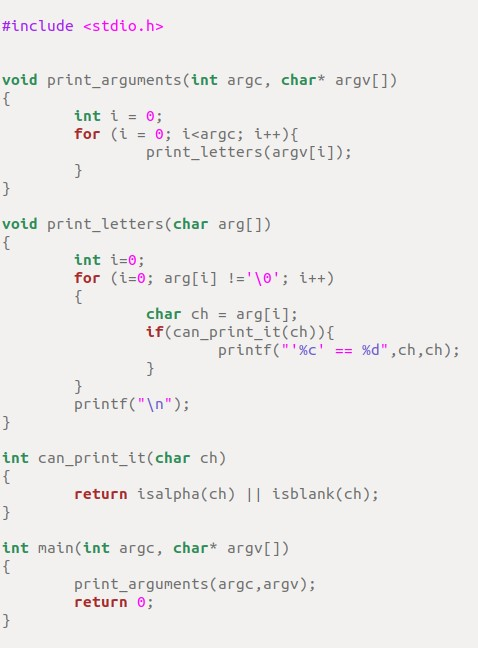
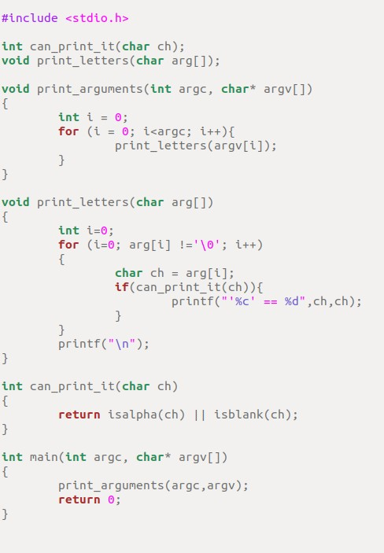
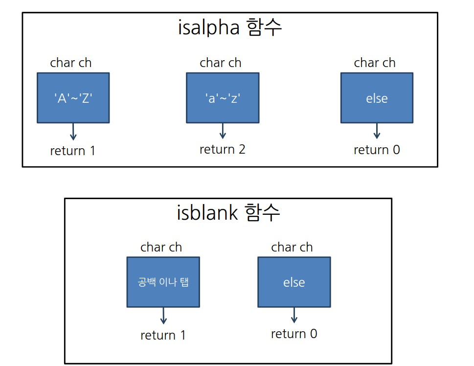

## 함수 전방선언

#### __전방선언 전__ 
 

>
>컴파일 순서가 맨윗부터 시작하여 아래로 진행되는데, print_arguments 함수에 print_letters는 컴파일러가 확인하지 못하였으므로 컴파일오류가 난다.
>

#### __전방선언 후__
 

>
>함수의 이름만 먼저 선언하여 컴파일러에게 이런 함수의 존재를 미리 알려주면 컴파일오류가 나지 않는다. 
>

## isalpha 와 isblank
 

