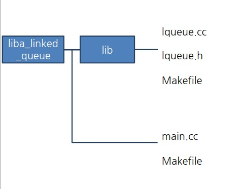

## 동적라이브러리 만들기

- 파일 구조 

### liblqueue.so 만들기
- g++ -fPIC -Wall -g -o lqueue.o -c lqueue.cc
- g++ -Wall -g -o -shared liblqueue.so lqueue.o

### 만들어진 liblqueue.so를 /usr/lib으로 보내기(리눅스에서 알아서 /usr/lib을 찾아가게됨.)
- cp liblqueue.so /usr/lib 

### liblqueue. 가 링킹된 실행파일 만들기(*main.cc에서 #include "lib/lqueue.h"로 라이브러리 경로 추가*)
- g++ -Wall -g -o main.o -c main.cc 
- g++ -Wall -g -o main main.o -llqueue

### 동적라이브러리를 사용한 main.exe 파일크기확인 

