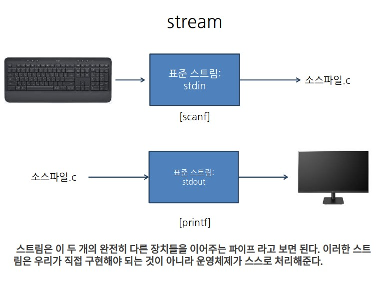
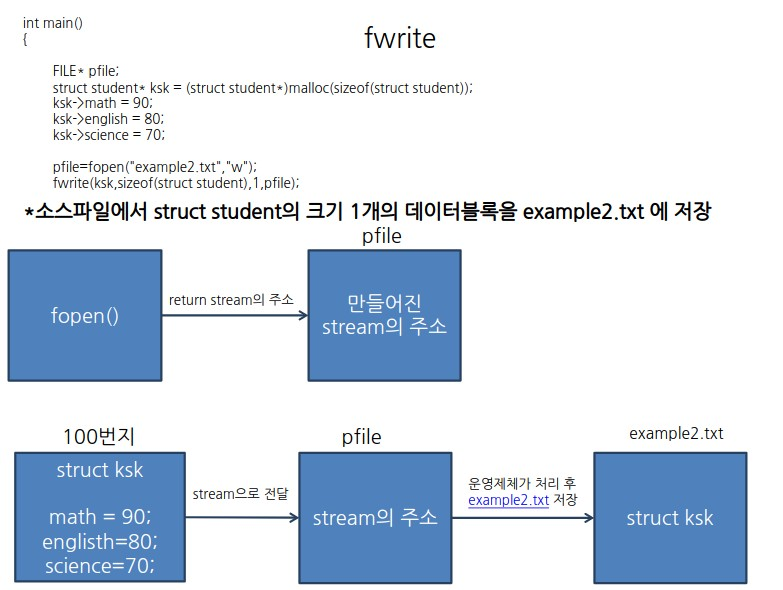
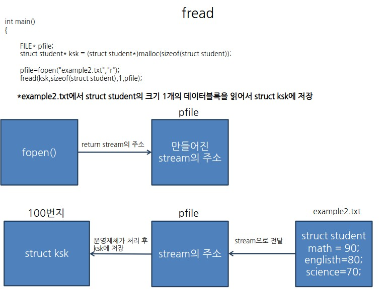
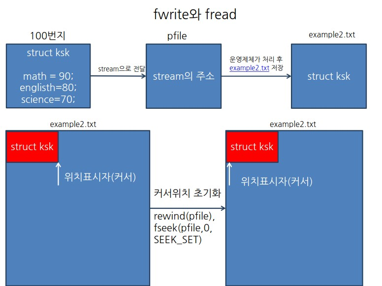

## fwrite와 fread

### stream 

### fwrite

### fread

### fwrite 와 fread 동시에 사용하기
- fopen() 시 w+,r+모드를 사용하면 읽기모드여도 쓸 수 있고, 쓰기모드여도 읽을 수 있다. 

>여기서 struct ksk 데이터 블록을 example2.txt에 쓰게되면 그 데이터블록의 바로 뒤에 위치하고있다. 
>그러므로 위치표시자의 위치를 그대로 두고 데이터를 읽게되면 공백에 데이터를 읽는것과 같다 
>데이터를 다 쓰고난 후 __rewind함수 또는 fseek함수__ 를 이용해 위치표시자를 초기화 한다. 

### int fread(FILE* stream long int offset, int origin) 함수
- stream : 작업을 수행할 스트림 주소를 가리키는 포인터
- offset : origin에서 얼마나 떨어진 위치에 위치표시자를 둘 것인가

- origin
|상수|위치표시자의 위치|
|:-:|:-:|
|SEEK_SET|파일의 시작|
|SEEK_CUR|현재파일의 포인터위치|
|SEEK_END|파일의 끝|
